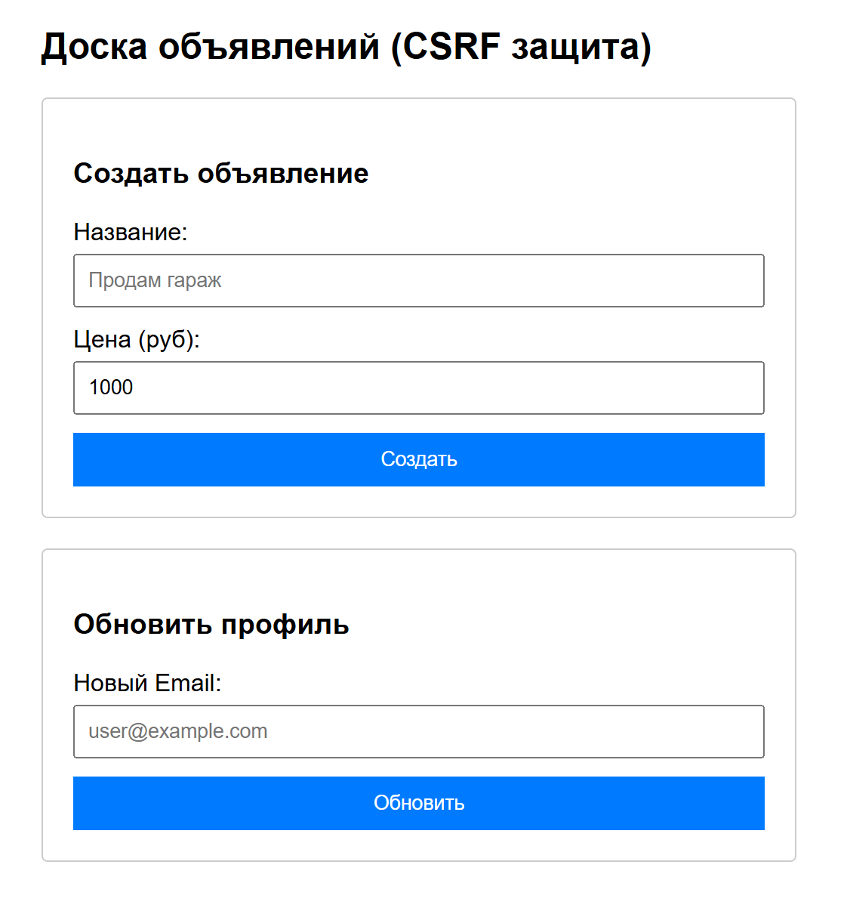
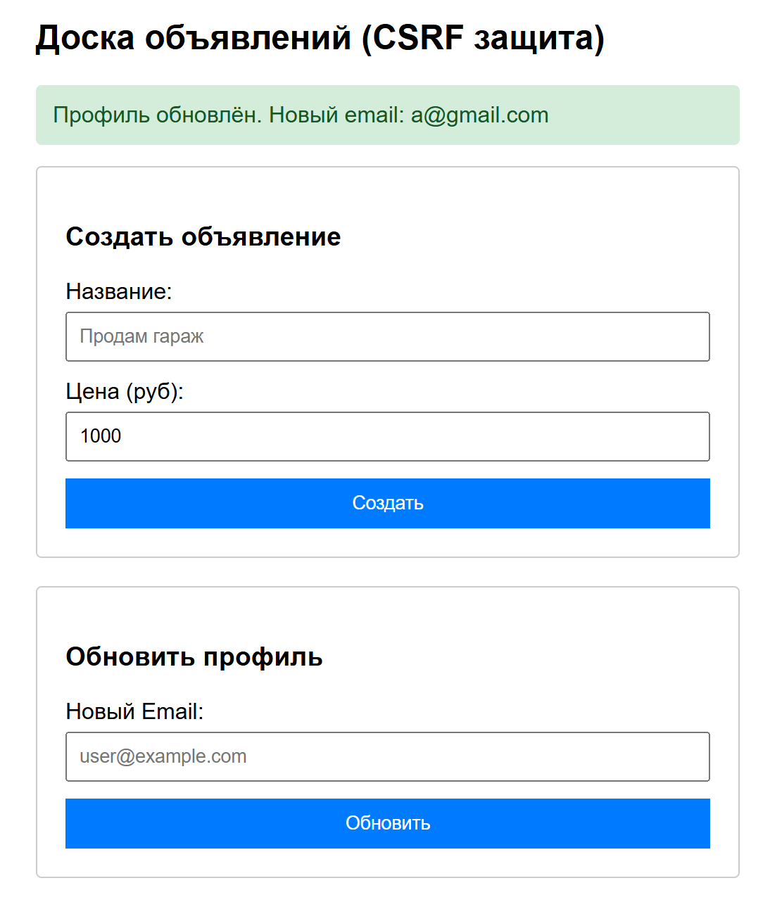
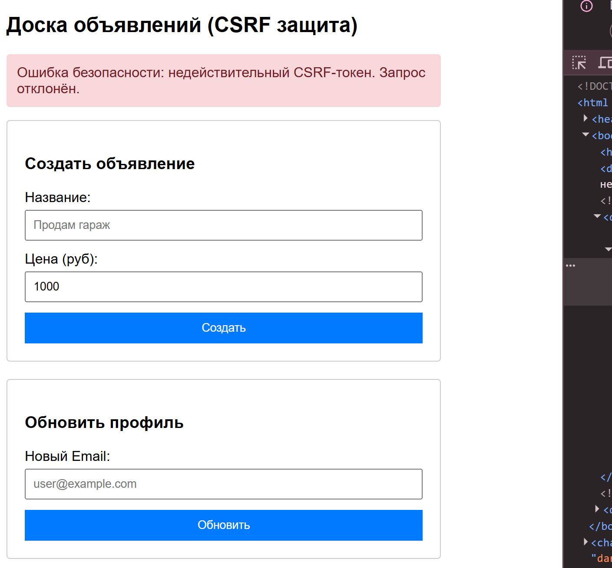

# csrf-security-lab
## Структура 

| Файл / Папка | Содержание |
|--------------|------------|
| `index.php` | Демонстрация CSRF-защиты (класс CsrfGuard, две формы) |
| `docs/` | Текстовые отчёты по заданиям |
| `docs/Задание_1.txt` | Задание 1: анализ уязвимостей маршрутов |
| `docs/Задание_2.txt` | Задание 2: архитектура защиты, псевдокод |
| `screenshots/` | Скриншоты работы приложения |
| `screenshots/form.png` | Пустая форма до отправки |
| `screenshots/success.png` | Успешная отправка формы |
| `screenshots/error.png` | Ошибка при неверном CSRF-токене |

## Задания
### Задание 1. Анализ CSRF-уязвимостей
Файл: `docs/Задание_1.txt`

### Задание 2. Архитектура CSRF-защиты
Файл: `docs/Задание_2.txt`

### Задание 3. Реализация защиты в PHP
Файл: `index.php`

## Запуск
1. Установить и запустить XAMPP (Apache)
2. Скопировать файл `index.php` в папку `C:\xampp\htdocs\csrf-demo\`
3. Открыть браузер и перейти по адресу `http://localhost/csrf-demo/`

## Скриншоты

| Пустая форма | Успешная отправка | Ошибка безопасности |
|--------------|-------------------|---------------------|
|  |  |  |

